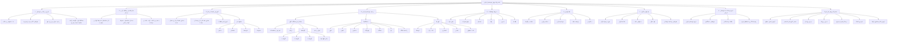

# README.md

# پلتفرم آموزش موسیقی ایرانی

```mermaid
flowchart TD
    A["پلتفرم آموزش موسیقی ایرانی"]

    A --> B["۱. تئوری و مبانی موسیقی"]
    A --> C["۲. سازشناسی و تکنیک تار و سه‌تار"]
    A --> D["۳. آموزش مقدماتی ساز"]
    A --> E["۴. ردیف موسیقی ایرانی"]
    A --> F["۵. فرم‌ها و قطعات"]
    A --> G["۶. بداهه‌نوازی"]
    A --> H["۷. همراهی با آواز"]
    A --> I["۸. تاریخ و شناخت موسیقی ایرانی"]
    A --> J["۹. مسیر آموزشی هنرجو"]

    B --> B1["نت، نت‌خوانی و علائم"]
    B --> B2["فواصل، گام، پرده و نیم‌پرده"]
    B --> B3["ریتم، میزان، وزن و تمپو"]
    B --> B4["دستگاه، آواز، گوشه، درآمد، شاهد، ایست و فرود"]

    C --> C1["تار: ساختمان، سیم‌ها، کوک و مضراب"]
    C --> C2["سه‌تار: ساختمان، سیم‌ها، کوک و ناخن"]
    C --> C3["پنجه، ریز، تکیه، دراب، غلت و تزئینات"]

    D --> D1["دستور مقدماتی تار و سه‌تار - جلد ۱"]
    D --> D2["دستور مقدماتی تار و سه‌تار - جلد ۲"]
    D --> D3["تمرین‌ها و قطعات"]
    D --> D4["سطح‌بندی"]
    D4 --> D41["مبتدی"]
    D4 --> D42["مقدماتی"]
    D4 --> D43["متوسط"]
    D4 --> D44["پیشرفته"]

    E --> E1["دستگاه‌ها"]
    E --> E2["آوازها"]
    E --> E3["ساختار هر دستگاه / آواز"]
    E3 --> E31["معرفی و مشخصات"]
    E3 --> E32["درآمد"]
    E3 --> E33["گوشه‌ها"]
    E33 --> E331["گوشه ۱"]
    E33 --> E332["گوشه ۲"]
    E33 --> E333["گوشه ۳"]
    E33 --> E334["سایر گوشه‌ها"]
    E3 --> E34["اجرای ردیف"]

    E1 --> E11["شور"]
    E1 --> E12["ماهور"]
    E1 --> E13["همایون"]
    E1 --> E14["چهارگاه"]
    E1 --> E15["سه‌گاه"]
    E1 --> E16["نوا"]
    E1 --> E17["راست‌پنجگاه"]

    E2 --> E21["ابوعطا"]
    E2 --> E22["بیات ترک"]
    E2 --> E23["افشاری"]
    E2 --> E24["دشتی"]
    E2 --> E25["بیات اصفهان"]

    F --> F1["پیش‌درآمد"]
    F --> F2["چهارمضراب"]
    F --> F3["تصنیف"]
    F --> F4["رنگ"]
    F --> F5["ضربی"]
    F --> F6["قطعه"]

    G --> G1["بداهه در گوشه"]
    G --> G2["جمله‌پردازی"]
    G --> G3["موتیف‌سازی"]
    G --> G4["توسعه جمله"]
    G --> G5["مدگردی"]

    H --> H1["فرود و جواب آواز"]
    H --> H2["شناخت آواز"]
    H --> H3["همراهی ساده"]
    H --> H4["جواب آواز"]
    H --> H5["همراهی و بداهه حرفه‌ای"]

    I --> I1["تاریخ موسیقی ایران"]
    I --> I2["موسیقی دستگاهی"]
    I --> I3["مکاتب و استادان"]
    I --> I4["ردیف‌ها، آثار و ضبط‌های مهم"]

    J --> J1["آزمون تعیین سطح"]
    J --> J2["مسیر آموزشی شخصی"]
    J --> J3["درس و ویدئو"]
    J --> J4["تمرین روزانه"]
    J --> J5["ارسال اجرای هنرجو"]
    J --> J6["بازخورد استاد"]
    J --> J7["آزمون پایان سطح و ارتقا"]
```

